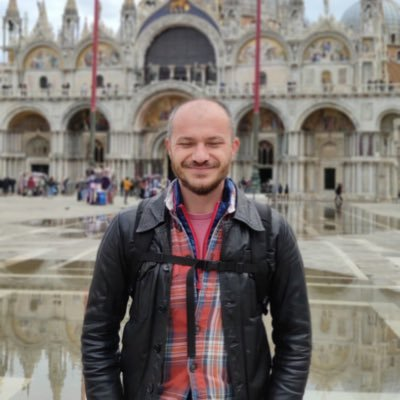

___

{ title="In front of camera held by M.Bernardes"} 

___
### {.tabset}
#### Bio

I am a (cross-cultural) social psychologist interested in researching on values, stereotype accommodation as well as old age stereotypes and discrimination. More recently, I also research on methods-related issues. I hold degrees in Sociology, Social Sciences and Psychology from universities in Romania, the Netherlands and Germany respectively. 

As of February 1st, I am a post-doctoral researcher (wissenschaftlicher Mitarbeiter) in Team Social Survey ([lead by Dr. Oshrat Hochman](https://www.researchgate.net/profile/Oshrat_Hochman)) at the department [Monitoring Society and Social Change](https://www.gesis.org/en/institute/departments/monitoring-society-and-social-change) at [GESIS-Leibniz Institute for the Social Sciences](https://www.gesis.org/en/home) in Mannheim.

In addition, I am a visiting scholar to prof. [Klaus Boehnke](https://www.jacobs-university.de/directory/kboehnke) at the department of Psychology and Methods, Jacobs University Bremen. 

I believe in research and teaching which treat participating individuals as human beings who each has their own life story, individual trait characteristics and, most importantly, opportunities in life. 

Thank you for your active interest in my current and past projects. Get in touch in case you want to know more about my projects, want to collaborate, or you would like to discuss presentation possibilities.

Dr. Adrian Stanciu

#### CV

Download a pdf copy of my vitae [here](pdf/cv_stanciu.pdf).

#### Social media

[{ width=5% title="Google Scholar"}](https://scholar.google.de/citations?user=vy80cu8AAAAJ&hl=en)&nbsp; &nbsp; &nbsp; &nbsp; [{ width=5% title="OrcId"}](https://orcid.org/0000-0001-8149-7829) &nbsp; &nbsp; &nbsp; &nbsp; [{ width=5% title="Research Gate"}](https://www.researchgate.net/profile/Adrian-Stanciu)&nbsp; &nbsp; &nbsp; &nbsp;  [{ width=5% title="Twitter"}](https://twitter.com/adrianvstanciu)&nbsp; &nbsp; &nbsp; &nbsp; [{ width=5% title="My photo website"}](http://adrianstanciuphoto.blogspot.com/)

#### Research interests

Ageing, assessment theory, cross-cultural research, individual and cultural change, inter-individual and inter-group relations, open science, stereotypes, values.

___

## <!---this allows for the tabset above to end and have the PS outside it--->
*PS: My website does not use cookies technology. Check yourself by following this set of [instructions](https://www.cookielawinfo.com/does-my-website-use-cookies/).*

___

