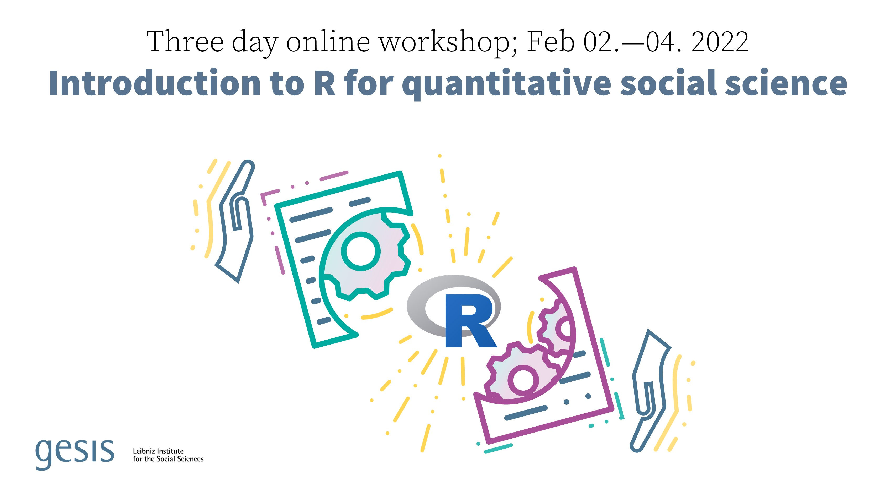

___

[{ width=70% align="" title="Intro to R"}](https://training.gesis.org/?site=pDetails&child=full&pID=0xAA72A87865CC455D928D910773D87AC5&lang=en_US)

Dr. [Ranjit Singh](https://www.gesis.org/institut/mitarbeiterverzeichnis/person/Ranjit.Singh) of GESIS-Institute for Social Sciences and I are holding an online introductory workshop to R for social scientists as part of the GESIS training program. 

**The workshop takes place online between 02.02.2022 - 04.02.2022**.

The course will cover everything from setting up R, loading data, preparing data, exploring data, performing basic analyses, and presenting your findings in automatically generated documents with text, tables, and graphics.

The workshop addresses quantitative researchers who want to start with R, be that for greater efficiency, more open and reproducible research, or more powerful and complex analyses. We assume that participants have no or only passing experience with R.

For additional information on the registration process and participation fee please see this [page](https://training.gesis.org/?site=pDetails&child=full&pID=0xAA72A87865CC455D928D910773D87AC5&lang=en_US) on the GESIS website. 

___

